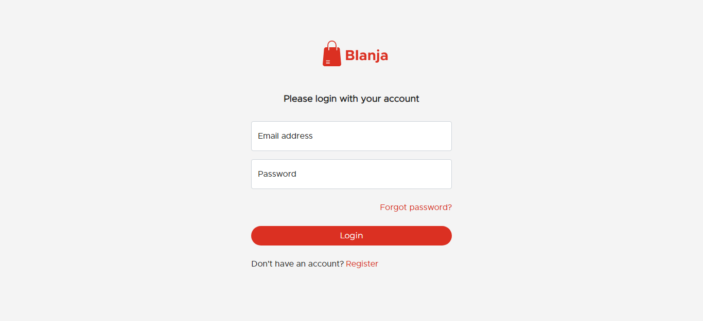
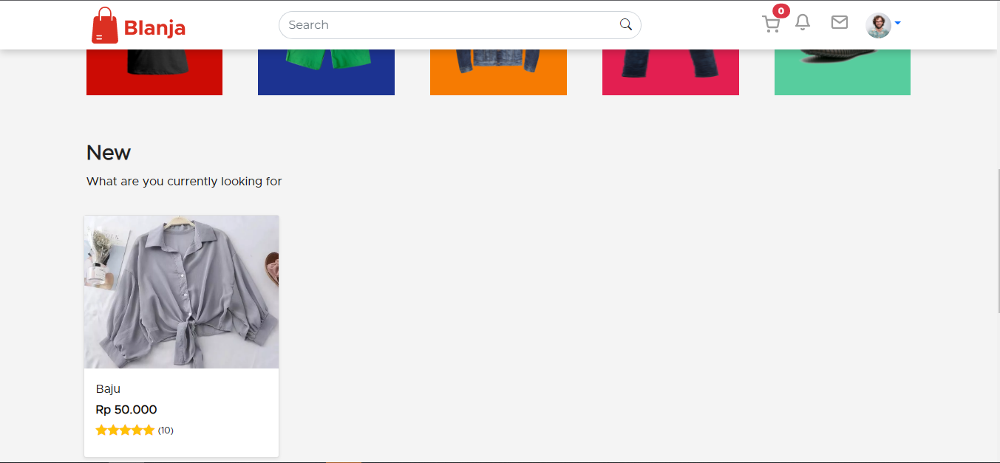
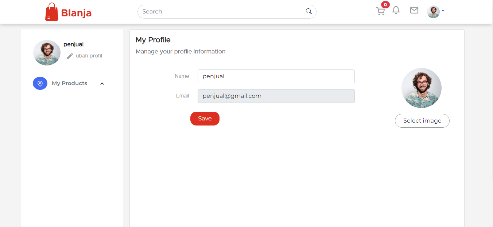
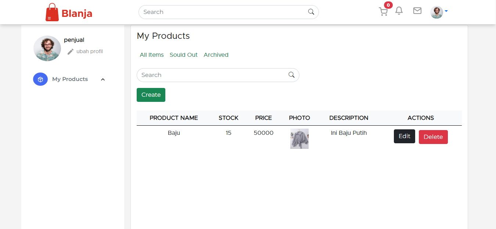
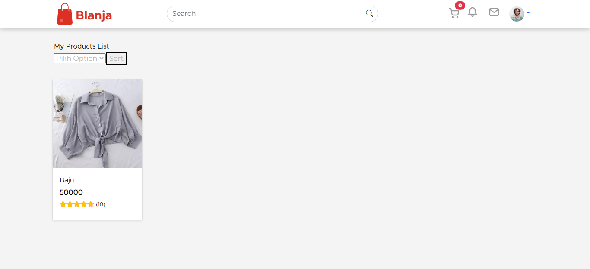

# Blanja

Blanja is an web application where you can buy a product that sold by seller in the website. You can pick various product from clothes, gadget, or any tools.

## Framework

[ReactJS](https://reactjs.org/)
[ExpressJS](https://expressjs.com/)

## Usage

First you need to clone the repositories.

```bash
git clone https://github.com/mallyaagung/Blanja-Frontend.git
```

After that run this command to install all the package needed.

```bash
npm install
```

Then, to run the app use this command

```bash
npm run start
```

## Demo

To use this app use this link

[Demo](https://blanja-five.vercel.app/)

## Screenshot






